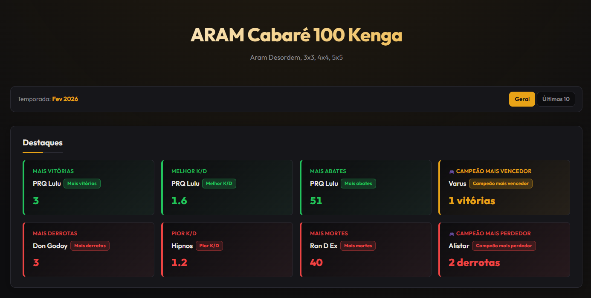
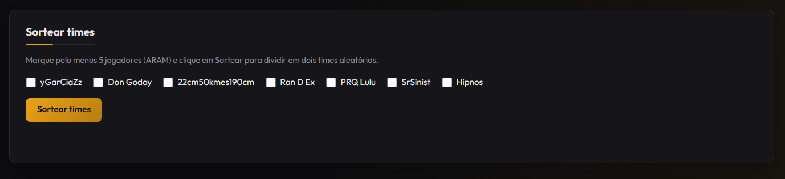
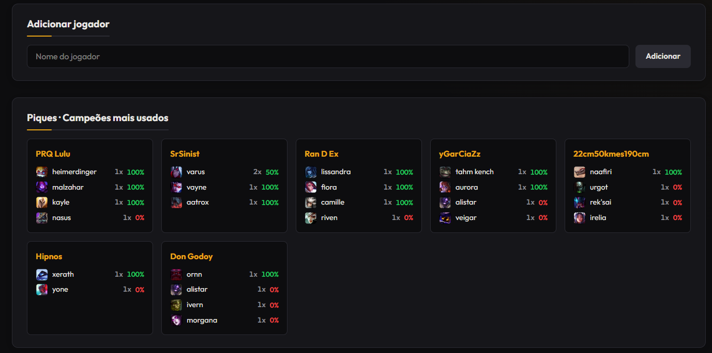
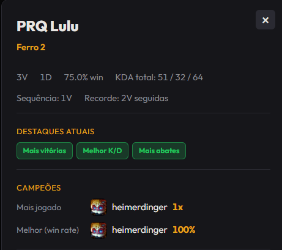
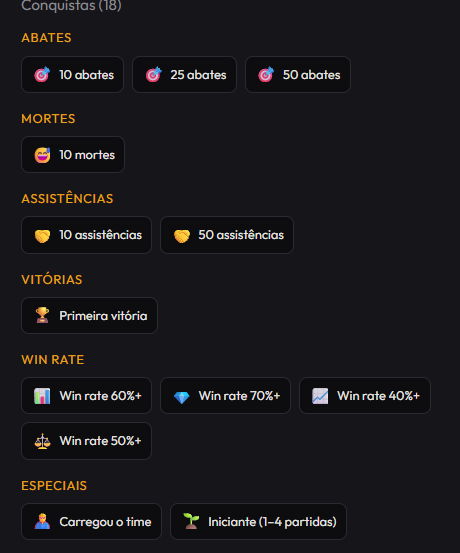

# Aram Ranked APP

[](https://github.com/Gleidisonjr/Aram-Ranked-APP)

Aplicativo web para ranking de partidas **ARAM** (League of Legends) entre amigos. Acompanhe vitórias, derrotas, ELO, KDA, campeões mais jogados, sorteio de times e conquistas. Pronto para publicar no **GitHub Pages** e compartilhar o link no Discord ou no grupo.

---

## Screenshots

| Seção | Descrição |
|-------|-----------|
| **Destaques** | Cards com mais vitórias, melhor K/D, mais abates, campeão mais vencedor e equivalentes negativos. |
| **Ranking** | Tabela com posição, jogador, ELO, V/D, últimos resultados, Win%, KDA, ratio e campeões. |
| **Sortear times** | Seleção de jogadores e divisão aleatória em dois times. |
| **Histórico** | Lista de partidas com data/hora, expansível para detalhes. |
| **Piques** | Campeões mais usados por jogador com ícones e win rate. |
| **Perfil** | Modal do jogador com estatísticas, destaques e campeões. |
| **Conquistas** | Conquistas desbloqueadas (abates, mortes, assistências, vitórias, win rate, especiais). |

| [](./docs/screenshots/destaques.png) | [](./docs/screenshots/historico.png) |
|:---:|:---:|
| *Destaques* | *Histórico de partidas* |

| [](./docs/screenshots/sortear-times.png) | [](./docs/screenshots/piques.png) |
|:---:|:---:|
| *Sortear times* | *Piques – Campeões mais usados* |

| [](./docs/screenshots/perfil-jogador.png) | [](./docs/screenshots/conquistas.png) |
|:---:|:---:|
| *Perfil do jogador* | *Conquistas* |

*(Clique nas imagens para ampliar.)*

---

## Funcionalidades

| Recurso | Descrição |
|--------|-----------|
| **Ranking** | Tabela com posição, jogador, ELO (patente LoL), V/D, últimos resultados, Win%, KDA, ratio e campeões mais jogado/melhor |
| **Destaques** | Cards com Mais vitórias, Melhor K/D, Mais abates, Campeão mais vencedor, Mais derrotas, Pior K/D, Mais mortes, Campeão mais perdedor |
| **Sortear times** | Seleção de jogadores → divisão aleatória em dois times + escolha de campeão por jogador → registro da partida |
| **Histórico** | Lista de partidas com vencedores, perdedores e KDA por jogador (cards recolhíveis) |
| **Perfil** | Modal por jogador com estatísticas, destaques atuais, campeões e conquistas |
| **Piques** | Seção “Campeões mais usados” por jogador com ícones (Data Dragon) e win rate |
| **Temporada** | Nome da temporada exibido; botão “Nova temporada” (modo admin) |
| **Filtro** | Visualizar ranking “Geral” ou “Últimas 10” partidas |
| **Exportar / imprimir** | Layout preparado para impressão do ranking |

---

## Stack

- **Vite** + **TypeScript**
- **Tailwind CSS**
- Dados: `public/ranking.json` (fonte principal) + `localStorage` (merge no carregamento)
- Ícones: [Data Dragon](https://developer.riotgames.com/docs/lol#data-dragon) (campeões) e [Community Dragon](https://raw.communitydragon.org) (emblemas de patente)

---

## Pré-requisitos

- [Node.js](https://nodejs.org/) 18+ (recomendado 20+)
- `npm`

---

## Começando

### Clone e instalação

```bash
git clone https://github.com/Gleidisonjr/Aram-Ranked-APP.git
cd Aram-Ranked-APP
npm install
```

### Desenvolvimento

```bash
npm run dev
```

Abre em `http://localhost:5173` (ou a porta indicada no terminal).

### Build para produção

```bash
npm run build
```

A saída fica em **`dist/`**. Essa pasta é usada para publicar no GitHub Pages, Netlify ou Vercel.

### Preview do build

```bash
npm run preview
```

---

## Publicação (GitHub Pages)

O repositório já inclui o workflow **GitHub Actions** para publicar no GitHub Pages.

1. No repositório: **Settings** → **Pages** → em **Build and deployment**, em **Source** escolha **GitHub Actions**.
2. Faça push na branch `main`. O workflow **Deploy to GitHub Pages** roda automaticamente.
3. O site ficará em:  
   **https://gleidisonjr.github.io/Aram-Ranked-APP/**

Para mais opções (Netlify, Vercel, passo a passo detalhado), veja **[COMO-PUBLICAR.md](./COMO-PUBLICAR.md)**.

---

## Modo admin (só para você)

No site publicado, os botões **Restaurar dados** e **Nova temporada** **não aparecem** para quem acessa o link normal.

Para ver e usar esses botões, acesse:

- **https://gleidisonjr.github.io/Aram-Ranked-APP/?admin=1**

Guarde esse link para uso pessoal; para o Discord e para os amigos use o link sem `?admin=1`.

---

## Estrutura do projeto

```
Aram-Ranked-APP/
├── .github/workflows/
│   └── deploy-pages.yml    # Deploy automático no GitHub Pages
├── public/
│   └── ranking.json       # Dados do ranking (jogadores + partidas)
├── src/
│   ├── main.ts            # UI e lógica da aplicação
│   ├── store.ts           # Dados, ranking, conquistas
│   ├── types.ts           # Tipos TypeScript
│   ├── ddragon.ts         # Ícones de campeões e emblemas de patente
│   └── style.css          # Estilos + Tailwind
├── docs/
│   └── ICONS-LOL.md       # Referência de ícones (Data Dragon, Community Dragon)
├── COMO-PUBLICAR.md       # Guia de publicação
├── COMO-USAR-PRINT.md     # Uso de prints de partida
├── IDEIAS-FEATURES.md     # Ideias de features
├── index.html
├── package.json
├── tsconfig.json
└── vite.config.ts
```

---

## Documentação adicional

- **[docs/PUBLICAR-GITHUB-PAGES.md](./docs/PUBLICAR-GITHUB-PAGES.md)** — Passo a passo para subir atualizações e publicar no GitHub Pages.
- **[COMO-PUBLICAR.md](./COMO-PUBLICAR.md)** — Publicar no GitHub Pages, Netlify ou Vercel e compartilhar o link.
- **[COMO-USAR-PRINT.md](./COMO-USAR-PRINT.md)** — Como usar prints de partida e atualizar o ranking.
- **[docs/RIOT-API-REMODEL.md](./docs/RIOT-API-REMODEL.md)** — Plano para buscar partidas direto da API da Riot (por match ID).
- **[docs/ICONS-LOL.md](./docs/ICONS-LOL.md)** — Uso de ícones de campeões e patentes (LoL).
- **[IDEIAS-FEATURES.md](./IDEIAS-FEATURES.md)** — Ideias e sugestões de evolução do app.

---

## Scripts

| Comando | Descrição |
|--------|-----------|
| `npm run dev` | Sobe o servidor de desenvolvimento (Vite). |
| `npm run build` | Gera o build de produção em `dist/`. |
| `npm run preview` | Serve a pasta `dist/` localmente para testar o build. |

---

## Repositório

**[github.com/Gleidisonjr/Aram-Ranked-APP](https://github.com/Gleidisonjr/Aram-Ranked-APP)**
